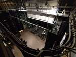
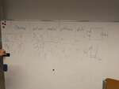

# 2023/2024

Kurz **Programování na Nuselské** bude probíhat od 21. září 2023
a volně navazuje na kurz **začátečníci**. Je určen pro děti druhých
až pátých tříd libovolné základní školy s tím, že děti druhých
tříd musí mít absolvovaný kurz začátečníci, šikovní jedinci z
řad třetích či čtvrtých tříd mohou přijít i bez předchozího
vzdělání.

Cílem tohoto kurzu je pokračování v rozvoji systematického
myšlení, hlubší poznávání světa informační techniky
a osvojení si základů elektrotechniky.

Kurz bude probíhat 1x týdně, každý čtvrtek od 14:15 do 15:05
v počítačové učebně.

V kurzu budeme využívat robůtky [Cubetto](https://www.primotoys.com),
[Beebot](https://www.bee-bot.us/) i [Ozobot](https://ozobot.com/).
Později si představíme platformu [Micro:bit](https://microbit.org)
a s ní zabředneme trochu blíže k elektrotechnice. Kromě těchto
se budeme věnovat i práci na PC, kde se budeme učit programovat
pomocí vybraných kurzů na [code.org](https://www.code.org),
prostředí [scratch](https://scratch.mit.edu/) a dalších.
To vše proložíme tvůrčími aktivitami s papírem, kostkami a jinými
rekvizitami.

Cílem kurzu není vzdělat hotového programátora, ale rozvíjet logické
myšlení, algoritmizaci a jiné vlastnosti, které se dětem budou hodit
při studiu jakéhokoliv oboru.

Kurz bude organizován a veden [Lukášem Doktorem](../lectors/ldoktor)

## 1. hodina

* Brainstorming ohledně projektů na tento rok, následně 3-hlasé hlasování
* Seznámení s naší online laboratoří
  * Některé projekty vyžadují specifické programy a nastavení, proto jsem se letos rozhodl vyzkoušet virtuální laboratoř. Pro děti jsem připravil virtuální počítače (webtop kontejnery) ke kterým se přihlašují ze školních počítačů. Tyto počítače jsou "jejich", čili si za tento rok vyzkouší správu vlastního PC i práci s operačním systémem GNU/Linux.
  * První úkol byl, změňte si pozadí, případně kurzory, panely a další

## 2. hodina

* Práce s online laboratoří
  * Nastavení "svých" počítačů - pozadí, panely, barvy, fonty, ...

## 3. hodina

* [Micro:bit](../assets/microbit)
  * Seznámení s Micro:bitem, jaké má vstupy, jaké výstupy, který "šváb" je zodpovědný za co, kde je anténa, ...
  * Ti co již Micro:bit znali tvořili program pro zaplnění obrazovky pomocí smyčky
  * Ti co viděli Micro:bit prvně se seznámili s prostředím makecode, základními kategoriemi, hlavně způsobem uploadu programu do Micro:bitu a vytvořili první program

## 4. hodina

* [Micro:bit](../assets/microbit)
  * Pokračování v projektech z minula, zaměření na přepínání z bločků do textového kódu v jazyce Python (nesetkalo se prozatím s vřelým přijetím, asi prozatím setrváme v bločkách)

## 5. hodina

* Exkurze do Kina Ostrov
  * Všechny fotky ke stažení [zde](exkurze.zip)
  * Indiánským během tam/zpět - od lampy k lampě běžím/jdu
  * Osvětlení veřejných prostor z rozvaděče
  * Technické zázemí kina/divadla - pult osvětlení, pult ozvučení, projektor s odvětráním, PC na pouštění filmů a spoustu kabelů označených a ve svazcích
    * Osvětlení pomocí scén
    * Výběr jednotlivých světel, intenzita, barva, směrování, šířka kuželu
    * Ručně, programově
  * Scéna, repro-bedny na kino ihned za plátnem (a po obvodu), spousta kladek
  * Podzemí - Plynové kotle, tepelné okruhy, dálkové vytápění pomocí venkovní teploty
  * Propadliště - černě natřené, zřídka kdy využívané
  * Šatny
  * Půda
    * stará světla 1kW (výkon jako 17 klasických žárovek) - zapojeno do stmívačů, barva pomocí filtrů, poloha otočením, šířka kužele páčkou
    * nové LED - zapojeno do zásuvky a na sběrnici, stmívají se digitálně; některé umí svítit barevně, obsahují motůrky pro otočení a šířku kužele
    * vše přiděláno kovovými lanky (prozatím jim nikdy nic nespadlo)
    * pohyblivé tyče na zavešení světel, šál, rekvizit i lidí
  * Vzduchotechnika - kontroluje množství CO2, udržuje teplotu, využívá teplotu vnitřního vzduchu k ohřátí nového venkovního vzduchu, následně dohřeje teplou vodou z plynových kotlů; dlouhé zpoždění od spuštění

## 6. hodina

* Shrnutí poznatků z exkurze
* Projekt Kino
  * Motivace
  * Definice cílů (Kino, Film)
  * Definice kroků (plán, řezání, lepení, kamera, osvětlení, ...)
  * Domácí úkol:
    * storyboard - A4 přeložit na 8 okének a načrtnout jednoduchý příběh na cca 30-60s
    * přemýšlet o "hráčích" - lego, figurky, plastelína, vystřihovánky, ...

## 7. hodina

* Projekt Kino
  * Studenti prezentovali jejich storyboardy, objevilo se několik zajímavých námětů, nakonec jsme zvolili cestu do vesmíru
  * Jedna skupinka vyráběla testovací objekty (raketu, paňáčky) a zkoušeli jejich využití
  * Druhá skupina se zaměřila na tvorbu kina, nejprve jsme dělali náčrtky, poté malý, testovací model a po určení rozměrů jsme začali připravovat model finální

## 8. hodina

* Projekt Kino
  * Opět jsme se rozdělili na mini-skupinky, jedna tvořila modely, druhá řezala a lepila kino

## 9. hodina

* Projekt Kino
  * Jedna skupinka vymýšlela, jak přichytit a ovládat oponu (potřebujeme provázky)
  * Druhá skupinka malovala kino
  * Třetí skupinka dělala pokusy s natáčením jednoduché stop-motion animace (zjisili jsme, že potřebujeme kabel, protože fotky nelze sdílet přes WiFi)

## 10. hodina

* Projek Kino
  * Jedna skupina se věnovala oponě
  * Druhá skupina zkoušela zkrotit [Kdenlive](https://kdenlive.org/) - open source nástroj na editování videa

## 11. hodina

* Projekt Kino
  * Jedna skupina testovala LED diody (zvyšování napětí do rozsvícení diody a postupné zvyšování napětí dokud plynule roste jas beze změny barvy; kontrola procházejícího proudu, rozhodně ne nad 30mA!)
  * Druhá skupina objevovala [Kdenlive](https://kdenlive.org/) - převážně titulky a trošku efekty
  * Zkušební spálení diody vysokým proudem (poměrně nudně prostě přestala svítit ale pozor, někdy se umí i rozstřelit!)

## 12. hodina

* [Projekt Kino](../assets/microbit/kino)
  * Představení technického řešení ovládání světel
  * Lehké seznámení s prostředím [micropythonu](https://python.microbit.org/v/3)
  * Ukázka bezdrátového ovládání světel pomocí GUI na počítači
  * Nepovedený pokus o rozsvícení světelného pásku

## 13. hodina

* [Projekt Kino](../assets/microbit/kino)
  * Práce v prostředí [micropythonu](https://python.microbit.org/v/3)
  * Klávesové zkratky: ``ctrl+c``, ``ctrl+v`` a ``ctrl+z`` (případně pravé tlačítko a kopírovat, vložit případně soubor a zpět)
  * Lehký úvod do jazyka Python (micropython), naučili jsme se změnit kanál, na kterém microbit komunikuje ``radio.config(group=25)``

## 14. hodina

* [Projekt Kino](../assets/microbit/kino)
  * Připojili jsme si k microbitu diodu na určitý pin a otestovali jsme její ovládání
  * Začali jsme testovat které piny můžeme využít pro ovládání dalších diod

## 15. hodina

* [Projekt Kino](../assets/microbit/kino)
  * Ukázali jsme si jak funguje nepájivé kontaktní pole (breadboard)
  * Vyzkoušeli jsme si připojení několika diod přímo a následně více diod s pomocí výkonového tranzistoru NPN TIP120:
    * 5V z "pevného" zdroje připojíme na vstup tranzistoru - Collector (2. pin)
    * Výstup z tranzistoru - Emitter (3. pin) přivedeme na diody
    * Druhý pin diody připojíme na zem - GND
    * Ovládací pin z microprocesoru (či 3V) přivedeme na ovládací vstup tranzistoru - Bázi (1. pin)
    * Výsledkem je že malým proudem přivedeným na bázi můžeme otevřít a zavřít obvod mezi Collectorem a Emitterem, čili rozsvěcet a zhasínat diody (či jinou zátěž až 5A a 60V!)

## 16. hodina

* [Projekt Kino](../assets/microbit/kino)
  * Z lega jsme vytvořili "lešení" tak, aby se nepohybovala a zároveň umožnila vložení LED diod
  * Začli jsme s instalací barevného LED pásku

## 17. hodina

* [Projekt Kino](../assets/microbit/kino)
  * Po jednom ukázka pájení drátů k diodám
  * Zbytek vždy "odpočíval" u <a href="https://scratch.mit.edu/projects/editor/">Scratche</a>

## 18. hodina

* [Projekt Kino](../assets/microbit/kino)
  * Otestování propojení zemí pomocí multimetru
  * Zapojení tranzistorů do nepájivých polí (breadboardů) a následné připojení k diodám
* Grafický tablet
  * 2 dobrovolníci testovali tvorbu obrázku (čáry, obloučky, stíny, 3d objekt a vlastní tvorbu) pomocí grafického tabletu a pro srovnání pomocí trackpointu (postuně se vystřídají všichni)

