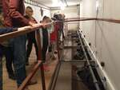
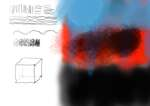
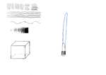

# 2023/2024

Kurz **Programování na Nuselské** bude probíhat od 21. září 2023
a volně navazuje na kurz **začátečníci**. Je určen pro děti druhých
až pátých tříd libovolné základní školy s tím, že děti druhých
tříd musí mít absolvovaný kurz začátečníci, šikovní jedinci z
řad třetích či čtvrtých tříd mohou přijít i bez předchozího
vzdělání.

Cílem tohoto kurzu je pokračování v rozvoji systematického
myšlení, hlubší poznávání světa informační techniky
a osvojení si základů elektrotechniky.

Kurz bude probíhat 1x týdně, každý čtvrtek od 14:15 do 15:05
v počítačové učebně.

V kurzu budeme využívat robůtky [Cubetto](https://www.primotoys.com),
[Beebot](https://www.bee-bot.us/) i [Ozobot](https://ozobot.com/).
Později si představíme platformu [Micro:bit](https://microbit.org)
a s ní zabředneme trochu blíže k elektrotechnice. Kromě těchto
se budeme věnovat i práci na PC, kde se budeme učit programovat
pomocí vybraných kurzů na [code.org](https://www.code.org),
prostředí [scratch](https://scratch.mit.edu/) a dalších.
To vše proložíme tvůrčími aktivitami s papírem, kostkami a jinými
rekvizitami.

Cílem kurzu není vzdělat hotového programátora, ale rozvíjet logické
myšlení, algoritmizaci a jiné vlastnosti, které se dětem budou hodit
při studiu jakéhokoliv oboru.

Kurz bude organizován a veden [Lukášem Doktorem](../lectors/ldoktor)

## 1. hodina

* Brainstorming ohledně projektů na tento rok, následně 3-hlasé hlasování
* Seznámení s naší online laboratoří
  * Některé projekty vyžadují specifické programy a nastavení, proto jsem se letos rozhodl vyzkoušet virtuální laboratoř. Pro děti jsem připravil virtuální počítače (webtop kontejnery) ke kterým se přihlašují ze školních počítačů. Tyto počítače jsou "jejich", čili si za tento rok vyzkouší správu vlastního PC i práci s operačním systémem GNU/Linux.
  * První úkol byl, změňte si pozadí, případně kurzory, panely a další

## 2. hodina

* [Tvorba modů do Minetestu](https://rubenwardy.com/minetest_modding_book)
  * Krátká připomínka hry [Minetest](https://www.minetest.net/) (opensource re-implementace Minecraftu s širokou podporou modů)
  * Vytváření souborů v systému windows (nutno v nastavení povolit zobrazení přípony souboru, abychom mohli vytvářet soubory `.lua` a `.conf`)
  * Vytvořili jsme základní strukturu našeho modu a započali s jeho tvorbou - `error` znamená chyba, text okolo nám napoví, co je potřeba udělat (použít pouze znaky `[a-zA-Z0-9_]` a podobně)

## 3. hodina

* [Tvorba modů do Minetestu](https://rubenwardy.com/minetest_modding_book)
  * Opakování toho, co jsme minule vytvořili a odladění nedodělků (převážně pojmenování modů/adresářů neodpovídající konvenci `[a-z0-9_]` a definici bloků s jiným prefixem než `$název_modu:`
  * Tvorba textury k našemu bločku v programu Malování (doporučení na změnu velikosti obrázku na 32x32, uložení do adresáře `$mod/textures/$nazev_obrazku.png`)

## 4. hodina

* [Tvorba modů do Minetestu](https://rubenwardy.com/minetest_modding_book)
  * Rychlá rekapitulace z minula, doladění názvů a správného umístění textury
  * Lehký úvod do typů v programovacím jazyce Lua:
    * číslo - 7
    * text - `"toto je text"`
    * seznam/pole - `{"jednotlive", "prvky", "seznamu"}`
    * slovník/mapování - `{nazev="hodnota", dalsi="jina hodnota"}`
  * Texturování každé strany zvlášť:
    * Krychle má 6 stran
    * (+Y, -Y, +X, -X, +Z, -Z)
    * horní, dolní, levá, pravá, přední, zadní

## 5. hodina

* Exkurze do Kina Ostrov
  * Všechny fotky ke stažení [zde](exkurze.zip)
  * Indiánským během tam/zpět - od lampy k lampě běžím/jdu
  * Osvětlení veřejných prostor z rozvaděče
  * Technické zázemí kina/divadla - pult osvětlení, pult ozvučení, projektor s odvětráním, PC na pouštění filmů a spoustu kabelů označených a ve svazcích
    * Osvětlení pomocí scén
    * Výběr jednotlivých světel, intenzita, barva, směrování, šířka kuželu
    * Ručně, programově
  * Scéna, repro-bedny na kino ihned za plátnem (a po obvodu), spousta kladek
  * Podzemí - Plynové kotle, tepelné okruhy, dálkové vytápění pomocí venkovní teploty
  * Propadliště - černě natřené, zřídka kdy využívané
  * Šatny
  * Půda
    * stará světla 1kW (výkon jako 17 klasických žárovek) - zapojeno do stmívačů, barva pomocí filtrů, poloha otočením, šířka kužele páčkou
    * nové LED - zapojeno do zásuvky a na sběrnici, stmívají se digitálně; některé umí svítit barevně, obsahují motůrky pro otočení a šířku kužele
    * vše přiděláno kovovými lanky (prozatím jim nikdy nic nespadlo)
    * pohyblivé tyče na zavešení světel, šál, rekvizit i lidí
  * Vzduchotechnika - kontroluje množství CO2, udržuje teplotu, využívá teplotu vnitřního vzduchu k ohřátí nového venkovního vzduchu, následně dohřeje teplou vodou z plynových kotlů; dlouhé zpoždění od spuštění

## 6. hodina

* Shrnutí poznatků z exkurze
* [Tvorba modů do Minetestu](https://rubenwardy.com/minetest_modding_book)
  * Tvorba komentářů - řádky začínající `--` jsou v jazyce Lua ignorovány a slouží pro naše poznámky
  * Pokračování v texturách

## 7. hodina

* Kino
  * Studenti prezentovali jejich storyboardy, objevilo se několik zajímavých námětů. Máme dva finalisty - "Cesta do vesmíru" a "Rok v životě veverek". Za domácí úkol mají žáci rozpracovat jejich preferované téma, abychom mohli příště určit vítěze.
* [Tvorba modů do Minetestu](https://rubenwardy.com/minetest_modding_book)
  * Aplikování různých textur pro jednotlivé strany jednoho bločku

## 8. hodina

* [Tvorba modů do Minetestu](https://rubenwardy.com/minetest_modding_book)
  * Dodělání různých textur pro jednotlivé strany bločku
  * Úvod do definice obsluhy různých událostí (klik pravým tlačítkem na blok, postavení bločku, ...)

## 9. hodina

* [Tvorba modů do Minetestu](https://rubenwardy.com/minetest_modding_book)
  * Pokračování v definicích obsluhy událostí
    * klik levým tlačítkem na postavený bloček - `on_punch(pozice, blocek, kdo_klikl, kam_ukazuje)`
    * klik pravým tlačítkem na postavený bloček - `on_rightclick(pozice, blocek, kdo_klikl, kam_ukazuje)`
    * postavení bločku - `on_construct(pozice, blocek)`
    * postavení bločku - více možností - `after_place_node(pozice, blocek, kdo_klikl, zasobnik, kam_ukazuje)`

## 10. hodina

* [Tvorba modů do Minetestu](../assets/minetest)
  * Pokračování v definicích obsluhy událostí
  * Nahrávání zvuků pomocí [online editoru zvuku](https://editor.audio/) ve formátu ``wav/mp3`` (neznámý původ, nepoužívat na důležité/citlivé nahrávání)
  * Konvertování zvuku do ``ogg`` pomocí [online konvertoru](https://convertio.co/mp3-ogg/) (neznámý původ, nepoužívat na důležité/citlivé nahrávky)
  * Přidání zvuků do módu pomocí ``minetest.sound_play("nazev_bez_pripony_ogg")``

## 11. hodina

* [Tvorba modů do Minetestu](../assets/minetest)
  * Pokračování tvorby zvuků s různými efekty pomocí [online editoru zvuku](https://editor.audio/) s následnou konverzí do ``ogg`` pomocí [online konvertoru](https://convertio.co/mp3-ogg/) (určitě existují lepší programy, leč školní počítače nejsou naše; pozor na soukromí, nepoužívat na důležité/citlivé nahrávky)

## 12. hodina

* [Tvorba modů do Minetestu](../assets/minetest)
  * Dokončení modů a jejich testování ve společné hře

## 13. hodina

* [Projekt Kino](../assets/microbit/kino)
  * Představení technického řešení ovládání světel
  * Lehké seznámení s prostředím [micropythonu](https://python.microbit.org/v/3)
  * Klávesové zkratky: ``ctrl+c``, ``ctrl+v`` a ``ctrl+z`` (případně pravé tlačítko a kopírovat, vložit případně soubor a zpět)
  * Ukázka bezdrátového ovládání světel pomocí GUI na počítači

## 14. hodina

* [Projekt Kino](../assets/microbit/kino)
  * Připojili jsme si k microbitu diodu na určitý pin a otestovali jsme její ovládání
  * Začali jsme testovat které piny můžeme využít pro ovládání dalších diod

## 15. hodina

* [Projekt Kino](../assets/microbit/kino)
  * Ukázali jsme si jak funguje nepájivé kontaktní pole (breadboard)
  * Vyzkoušeli jsme si připojení několika diod přímo a následně více diod s pomocí výkonového tranzistoru NPN TIP120:
    * 5V z "pevného" zdroje připojíme na vstup tranzistoru - Collector (2. pin)
    * Výstup z tranzistoru - Emitter (3. pin) přivedeme na diody
    * Druhý pin diody připojíme na zem - GND
    * Ovládací pin z microprocesoru (či 3V) přivedeme na ovládací vstup tranzistoru - Bázi (1. pin)
    * Výsledkem je že malým proudem přivedeným na bázi můžeme otevřít a zavřít obvod mezi Collectorem a Emitterem, čili
 rozsvěcet a zhasínat diody (či jinou zátěž až 5A a 60V!)

## 16. hodina

* [Projekt Kino](../assets/microbit/kino)
  * Začli jsme instalovat diody do lešení z lega nad scénou a rozdělením okruhů na 5 microbitů (popisky pomocí lepiček)

## 17. hodina

* [Projekt Kino](../assets/microbit/kino)
  * Po jednom ukázka pájení drátů k diodám
  * Zbytek vždy "odpočíval" u <a href="https://scratch.mit.edu/projects/editor/">Scratche</a>

## 18. hodina

* [Projekt Kino](../assets/microbit/kino)
  * Otestování propojení zemí pomocí multimetru
  * Zapojení tranzistorů do nepájivých polí (breadboardů) a následné připojení k diodám
  * Testování zapojení pomocí stabilizovaného zdroje
* Grafický tablet
  * 2 dobrovolníci testovali tvorbu obrázku (čáry, obloučky, stíny, 3d objekt a vlastní tvorbu) pomocí grafického tabletu a pro srovnání pomocí trackpointu (postuně se vystřídají všichni)

## 19. hodina

* [Projekt Kino](../assets/microbit/kino)
  * Kontrola zapojení pomocí multimetru
  * Propojování výstupů microbitu k tranzistorům
    * napětí bezpečné pro všechny diody se přivede na diody, odtud na Colector tranzistoru. Emitor se svede na zem a propojí se zemí microbitu. Výstup z pinu microbitu připojíme (správně přes rezistor) k bázi
    * obyčejný NPN BC337 má výstupy Colector, Báze, Emitor
    * výkonový NPN TIP120 má výstupy Báze, Colector, Emitor
* Grafický tablet
  * 2 dobrovolníci testovali tvorbu obrázku (čáry, obloučky, stíny, 3d objekt a vlastní tvorbu) pomocí grafického tabletu a pro srovnání pomocí myši (postuně se vystřídají všichni)

## 20. hodina

* [Projekt Kino](../assets/microbit/kino)
  * Výměna ledek za programovatelný led-pásek (ledky měli nedostatečný svit)
  * Test ovládání pomocí grafického rozhraní se 3 moduly na světlo (barva, pozice, šířka)
  * Test natáčení zabarvené scény

## 21. hodina

* [Projekt Kino](../assets/microbit/kino)
  * Prošli jsme si jak funguje [skript](../assets/microbit/kino#nat%C3%A1%C4%8Den%C3%AD-stop-motion-animace), který po stisku klávesy `ENTER` pořídil fotografii na telefonu, stáhl ji do počítače, zobrazil ji a zároveň kombinaci předchozí a současné fotky vedle sebe.
  * Nafotili krátký příběh o policistce a skřítkovi

## 22. hodina

* [Projekt Kino](../assets/microbit/kino)
  * Shlédli jsme testovací verzi animace z materiálu z předchozí hodiny a rozhodli jsme se pouze znovu natočit stejný scénář s jemnějším krokem a drobnými úpravami abychom měli více času na počítačové efekty.
  * "Opravili" jsme problém s nažloutlým a pohaslým světlem při plném světle LED pásku připojením napájení z obou stran (bylo by za potřebí připojit ještě další větev cca uprostřed, pásek je hodně dlouhý)
  * Pustili jsme se do natáčení

## 23. hodina

* [Projekt Kino](../assets/microbit/kino)
  * Využili jsme pozadí od předchozí skupiny a natočili novou verzi příběhu včetně pohyblivého pozadí

## 24. hodina

* [Projekt Kino](../assets/microbit/kino)
  * Očištění fotografií (minulou hodinu nám sluníčko "přesvětlilo" některé fotky, používáme automatickou opravu barev + manuální doladění "expozice", "jasu", "kontrastu" a případně i "sytosti barev")
  * Spojení fotek do videa v programu [Kdenlive](https://kdenlive.org/en/) - ``Projekt->Přidat obrázkovou sekvenci``, zvolit složku s fotkami, nastavit "Trvání rámce" + "Rozplynutí"

## 25. hodina

* [Projekt Kino](../assets/microbit/kino)
  * "Stříhali" jsme video v programu [Kdenlive](https://kdenlive.org/en/) pomocí ``x`` a myší jsme jej rozdělili na části a ``s`` posunuli na správné místo. Někteří přidali ještě statické obrázky před/po či zrychlili/zpomalili části pomocí pravého tlačítka a ``change speed``
  * Přidali jsme efekt ``Transformace``, který nám umožní zvětšit/posunout část videa
  * Přidali jsme zvuky motoru, majáků a bouraček do správných míst (pravým tlačítkem jsme si přidali více stop - více souběžných zvuků)

## 26. hodina

* [Projekt Kino](../assets/microbit/kino)
  * Střihání a natahování částí filmu/zvuku pomocí ``pravého tlačítka->change speed`` (pozor, musí být za klipem dost místa na časové ose)
  * Sladění zvuku a videa

## 27. hodina

* [Projekt Kino](../assets/microbit/kino)
  * Stříhání videa a přidání titulků (průhledné, pohyblivé, ...)

## 28. hodina

* [Pyladies python kurz](https://naucse.python.cz/course/pyladies/)
  * Seznámení s příkazovou řádkou:
    * ``pwd`` - současný adresář (print working directory)
    * ``ls`` - zobraz soubory/složky v současném adresáři (list directory)
    * ``cd`` - změň současný adresář (change directory)
      * ``cd python``  (jdi do složky "python" v současném adresáři)
      * ``cd``  (vrať se do domovské složky)
      * ``cd -``  (vrať se do předchozího pracovního adresáře)
    * ``mkdir $NÁZEV_ADRESÁŘE`` - vytvoř adresář (make directory)
    * ``python3`` - spustit interpreter pythonu3
    * šipka nahoru/dolu - předchozí/následující příkaz z historie
    * ``ctrl+r`` - vyhledej příkaz v historii
    * ``ctrl+c`` - přerušit
    * Online terminál (s jistými omezeními) [zde](https://www.tutorialspoint.com/linux_terminal_online.php)
  * Otevřeli jsme si interpret pythonu a zkusili, jak zareaguje na pár příkazů (3+4, 5/7, ahoj, ...)
    * Online python (bez interpreteru) [zde](https://www.online-python.com/)

