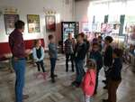

# 2023/2024

Kurz **Programování na Nuselské** bude probíhat od 21. září 2023
a volně navazuje na kurz **začátečníci**. Je určen pro děti druhých
až pátých tříd libovolné základní školy s tím, že děti druhých
tříd musí mít absolvovaný kurz začátečníci, šikovní jedinci z
řad třetích či čtvrtých tříd mohou přijít i bez předchozího
vzdělání.

Cílem tohoto kurzu je pokračování v rozvoji systematického
myšlení, hlubší poznávání světa informační techniky
a osvojení si základů elektrotechniky.

Kurz bude probíhat 1x týdně, každý čtvrtek od 14:15 do 15:05
v počítačové učebně.

V kurzu budeme využívat robůtky [Cubetto](https://www.primotoys.com),
[Beebot](https://www.bee-bot.us/) i [Ozobot](https://ozobot.com/).
Později si představíme platformu [Micro:bit](https://microbit.org)
a s ní zabředneme trochu blíže k elektrotechnice. Kromě těchto
se budeme věnovat i práci na PC, kde se budeme učit programovat
pomocí vybraných kurzů na [code.org](https://www.code.org),
prostředí [scratch](https://scratch.mit.edu/) a dalších.
To vše proložíme tvůrčími aktivitami s papírem, kostkami a jinými
rekvizitami.

Cílem kurzu není vzdělat hotového programátora, ale rozvíjet logické
myšlení, algoritmizaci a jiné vlastnosti, které se dětem budou hodit
při studiu jakéhokoliv oboru.

Kurz bude organizován a veden [Lukášem Doktorem](../lectors/ldoktor)

## 1. hodina

* Brainstorming ohledně projektů na tento rok, následně 3-hlasé hlasování
* Seznámení s naší online laboratoří
  * Některé projekty vyžadují specifické programy a nastavení, proto jsem se letos rozhodl vyzkoušet virtuální laboratoř. Pro děti jsem připravil virtuální počítače (webtop kontejnery) ke kterým se přihlašují ze školních počítačů. Tyto počítače jsou "jejich", čili si za tento rok vyzkouší správu vlastního PC i práci s operačním systémem GNU/Linux.
  * První úkol byl, změňte si pozadí, případně kurzory, panely a další

## 2. hodina

* [Tvorba modů do Minetestu](https://rubenwardy.com/minetest_modding_book)
  * Krátká připomínka hry [Minetest](https://www.minetest.net/) (opensource re-implementace Minecraftu s širokou podporou modů)
  * Vytváření souborů v systému windows (nutno v nastavení povolit zobrazení přípony souboru, abychom mohli vytvářet soubory `.lua` a `.conf`)
  * Vytvořili jsme základní strukturu našeho modu a započali s jeho tvorbou - `error` znamená chyba, text okolo nám napoví, co je potřeba udělat (použít pouze znaky `[a-zA-Z0-9_]` a podobně)

## 3. hodina

* [Tvorba modů do Minetestu](https://rubenwardy.com/minetest_modding_book)
  * Opakování toho, co jsme minule vytvořili a odladění nedodělků (převážně pojmenování modů/adresářů neodpovídající konvenci `[a-z0-9_]` a definici bloků s jiným prefixem než `$název_modu:`
  * Tvorba textury k našemu bločku v programu Malování (doporučení na změnu velikosti obrázku na 32x32, uložení do adresáře `$mod/textures/$nazev_obrazku.png`)

## 4. hodina

* [Tvorba modů do Minetestu](https://rubenwardy.com/minetest_modding_book)
  * Rychlá rekapitulace z minula, doladění názvů a správného umístění textury
  * Lehký úvod do typů v programovacím jazyce Lua:
    * číslo - 7
    * text - `"toto je text"`
    * seznam/pole - `{"jednotlive", "prvky", "seznamu"}`
    * slovník/mapování - `{nazev="hodnota", dalsi="jina hodnota"}`
  * Texturování každé strany zvlášť:
    * Krychle má 6 stran
    * (+Y, -Y, +X, -X, +Z, -Z)
    * horní, dolní, levá, pravá, přední, zadní

## 5. hodina

* Exkurze do Kina Ostrov
  * Všechny fotky ke stažení [zde](exkurze.zip)
  * Indiánským během tam/zpět - od lampy k lampě běžím/jdu
  * Osvětlení veřejných prostor z rozvaděče
  * Technické zázemí kina/divadla - pult osvětlení, pult ozvučení, projektor s odvětráním, PC na pouštění filmů a spoustu kabelů označených a ve svazcích
    * Osvětlení pomocí scén
    * Výběr jednotlivých světel, intenzita, barva, směrování, šířka kuželu
    * Ručně, programově
  * Scéna, repro-bedny na kino ihned za plátnem (a po obvodu), spousta kladek
  * Podzemí - Plynové kotle, tepelné okruhy, dálkové vytápění pomocí venkovní teploty
  * Propadliště - černě natřené, zřídka kdy využívané
  * Šatny
  * Půda
    * stará světla 1kW (výkon jako 17 klasických žárovek) - zapojeno do stmívačů, barva pomocí filtrů, poloha otočením, šířka kužele páčkou
    * nové LED - zapojeno do zásuvky a na sběrnici, stmívají se digitálně; některé umí svítit barevně, obsahují motůrky pro otočení a šířku kužele
    * vše přiděláno kovovými lanky (prozatím jim nikdy nic nespadlo)
    * pohyblivé tyče na zavešení světel, šál, rekvizit i lidí
  * Vzduchotechnika - kontroluje množství CO2, udržuje teplotu, využívá teplotu vnitřního vzduchu k ohřátí nového venkovního vzduchu, následně dohřeje teplou vodou z plynových kotlů; dlouhé zpoždění od spuštění

## 6. hodina

* Shrnutí poznatků z exkurze
* [Tvorba modů do Minetestu](https://rubenwardy.com/minetest_modding_book)
  * Tvorba komentářů - řádky začínající `--` jsou v jazyce Lua ignorovány a slouží pro naše poznámky
  * Pokračování v texturách

## 7. hodina

* Kino
  * Studenti prezentovali jejich storyboardy, objevilo se několik zajímavých námětů. Máme dva finalisty - "Cesta do vesmíru" a "Rok v životě veverek". Za domácí úkol mají žáci rozpracovat jejich preferované téma, abychom mohli příště určit vítěze.
* [Tvorba modů do Minetestu](https://rubenwardy.com/minetest_modding_book)
  * Aplikování různých textur pro jednotlivé strany jednoho bločku

## 8. hodina

* [Tvorba modů do Minetestu](https://rubenwardy.com/minetest_modding_book)
  * Dodělání různých textur pro jednotlivé strany bločku
  * Úvod do definice obsluhy různých událostí (klik pravým tlačítkem na blok, postavení bločku, ...)

## 9. hodina

* [Tvorba modů do Minetestu](https://rubenwardy.com/minetest_modding_book)
  * Pokračování v definicích obsluhy událostí
    * klik levým tlačítkem na postavený bloček - `on_punch(pozice, blocek, kdo_klikl, kam_ukazuje)`
    * klik pravým tlačítkem na postavený bloček - `on_rightclick(pozice, blocek, kdo_klikl, kam_ukazuje)`
    * postavení bločku - `on_construct(pozice, blocek)`
    * postavení bločku - více možností - `after_place_node(pozice, blocek, kdo_klikl, zasobnik, kam_ukazuje)`

## 10. hodina

* [Tvorba modů do Minetestu](../assets/minetest)
  * Pokračování v definicích obsluhy událostí
  * Nahrávání zvuků pomocí [online editoru zvuku](https://editor.audio/) ve formátu ``wav/mp3`` (neznámý původ, nepoužívat na důležité/citlivé nahrávání)
  * Konvertování zvuku do ``ogg`` pomocí [online konvertoru](https://convertio.co/mp3-ogg/) (neznámý původ, nepoužívat na důležité/citlivé nahrávky)
  * Přidání zvuků do módu pomocí ``minetest.sound_play("nazev_bez_pripony_ogg")``

## 11. hodina

* [Tvorba modů do Minetestu](../assets/minetest)
  * Pokračování tvorby zvuků s různými efekty pomocí [online editoru zvuku](https://editor.audio/) s následnou konverzí do ``ogg`` pomocí [online konvertoru](https://convertio.co/mp3-ogg/) (určitě existují lepší programy, leč školní počítače nejsou naše; pozor na soukromí, nepoužívat na důležité/citlivé nahrávky)

