# 2023/2024

Kurz **Programování na Nuselské** bude probíhat od 21. září 2023
a je určen pro děti prvních[1](#footnote1) a druhých
tříd dětí z libovolných škol. Cílem těchto kurzů je rozvíjení
přirozené touhy dětí po poznávání okolního světa s důrazem na
techniku a rozvoj systematického myšlení.

Kurz bude probíhat 1x týdně každý čtvrtek od 13:15 do 14:05 v počítačové
učebně.

V kurzu budeme využívat robůtky [Cubetto](https://www.primotoys.com),
[Beebot](https://www.bee-bot.us/) i [Ozobot](https://ozobot.com/).
Zároveň se budeme věnovat i práci na PC pomocí open source aplikace
[GCompris](https://gcompris.net) a začneme kurzy z platformy
[code.org](https://[www.code.org](https://www.code.org)). Pro zpestření budou kurzy provázeny
tvůrčími aktivitami s papírem, kostkami a jinými rekvizitami.

Cílem kurzu není vzdělat hotového programátora, ale rozvíjet logické
myšlení, algoritmizaci a jiné vlastnosti, které se dětem budou hodit
při studiu jakéhokoliv oboru.

Kurz bude organizován a veden [Lukášem Doktorem](../lectors/ldoktor)

## 1. hodina

<a href="zacatecnici-1-01-beebot.jpg">
    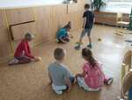
</a>

* Beeboti
  * Pohyb vpřed a vzad
* Seznámení s PC
  * Přihlášení pomocí jména a hesla
  * Práce s myší pomocí [decko zvěřince](https://decko.ceskatelevize.cz/tercin-zvireci-svet/zverinec)

## 2. hodina

* Stránky [www.code.org](https://www.code.org)
  * Nastavení účtu
  * Bludiště s Angry birds
* Beeboti
  * Umístění na podložce (souřadnice a směr - A1W, C3S, D6N, A2E, ...)

## 3. hodina

<a href="zacatecnici-1-03-pexeso.jpg">
    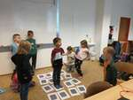
</a>

* Beeboti
  * Opakování umístění na podložce (B2W, E6N, ...)
* Lidské pexeso (naprogramuj spolužáka a spusť; vyčkej na instrukce a proveď)
* Stránky [www.code.org](https://www.code.org)
  * Bludiště s Angry birds

## 4. hodina

* Stránky [www.code.org](https://www.code.org)
  * Bludiště s Angry birds
  * Věšina se již dostala i do Sklízeče
* Opakovací písnička
  * nácvik cyklů/opakování
  * 3x(3xtlesk, 2x(levá nahoru, pravá nahoru), 3x tlesk, ...), hahaha

## 5. hodina

<a href="zacatecnici-1-05-cubetto.jpg">
    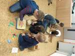
</a>

* Stránky [www.code.org](https://www.code.org)
  * Programování cyklů se sklízečem
* Cubetto
  * Krátké seznámení s robůtkem Cubetto (Kubík), který nám v následujících hodinách pomůže s opakováním/funkcemi

## 6. hodina

* Stránky [www.code.org](https://www.code.org)
  * Programování cyklů se sklízečem, někdo již začal Laurela
* Cubetto
  * Jednotlivě řešení [úkolů](../assets/cubetto-ukoly.ods) na mapě

## 7. hodina

<a href="zacatecnici-1-07-cubetto.jpg">
    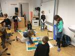
</a>

* Cubetto
  * Společné opakování
  * řešení [úkolů](../assets/cubetto-ukoly.ods) na mapě po dvojicích
* Stránky [www.code.org](https://www.code.org)
  * Programování cyklů se sklízečem, někdo již začal Laurela

## 8. hodina

<a href="zacatecnici-1-08-cubetto.jpg">
    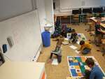
</a>

* Cubetto
  * pokračování v řešení [úkolů](../assets/cubetto-ukoly.ods) na mapě společně

## 9. hodina

* Stránky [www.code.org](https://www.code.org)
  * Cykly s Laurelem, někteří se dostali i na kreslení zahrad
* Na závěr za odměnu děti zkusily [Minetest](https://www.minetest.net/), některé pak [OpenTTD](https://www.openttd.org/)

## 10. hodina

<a href="zacatecnici-1-10-andel.jpg">
    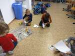
</a>

* Anděl
  * Seznámení se zvukovými funkcemi Beebota
  * Seznámení s hudební notovou osnovou (výška tónu, délka tónu, pořadí)
  * Tvorba melodie pomocí Beebota
  * Výroba [převleku](https://blog.tts-group.co.uk/wp-content/uploads/2019/03/Bee-Bot_Jacket.pdf) pro Beebota

## 11. hodina

<a href="zacatecnici-1-11-koledy.jpg">
    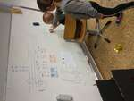
</a>

* Koledy
  * Dodělání [převleků](https://blog.tts-group.co.uk/wp-content/uploads/2019/03/Bee-Bot_Jacket.pdf) pro Beebota
  * Opakování hudební notové osnovy
  * Tvorba melodie pomocí Beebota

## 12. hodina

<a href="zacatecnici-1-12-rle.jpg">
    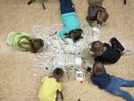
</a>
<a href="zacatecnici-1-12-koledy.jpg">
    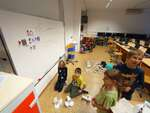
</a>

* RLE - Run Length Encoding
  * Jednoduché kódování používané dříve v grafických kratách
  * Definuje počet opakování stejné hodnoty/barvy, zpravidla se střídají 2 hodnoty/barvy
  * Děti "dekódovali" řádky [vánočních obrázků](../assets/rle-vanoce.pdf) ([ods](../assets/rle-vanoce.ods))
* Koledy
  * Krátká rekapitulace notové osnovy a procesu transformace notového zápisu na program pro včelky
  * Z důvodu nedostatku času pak pouze krátká ukázka koledy "Narodil se Kristus Pán" v podání 3 včelek-andílků

## 13. hodina

<a href="zacatecnici-1-13-roboti.jpg">
    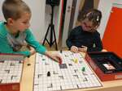
</a>

* RLE - Run Length Encoding
  * Kdo měl zájem pokračoval v obrázcích kódovaných pomocí RLE a jejich realizaci pomocí oboustranné lepicí pásky a 5D diamantů
* Ricochet Robots
  * Ostatní zkoušeli informatickou deskovku Ricochet Robots kde se snaží najít optimální cesty pro roboty s rozbitými brzdami

## 14. hodina

<a href="zacatecnici-1-14-boffin.jpg">
    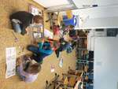
</a>

* Elektrická stavebnice Boffin
  * S pomocí [videa](https://www.youtube.com/watch?v=mc979OhitAg&list=PLWv9VM947MKi_7yJ0_FCfzTBXpQU-Qd3K&index=1&pp=iAQB) jsme si řekli něco málo o atomech, vodivosti a elektřině
  * Následně jsme vyzkoušeli několik zapojení stavebnice Boffin

## 15. hodina

* Elektrická stavebnice Boffin
  * Dnes byla spíš zábavná hodina zaměřena na stavbu projektů dle vlastního uvážení
  * Vysvětlili jsme si princip "větrákového LED displaye" (ledky jsou umístěny na vrtulce a "počítač" je rozsvěcí a zhasíná v závislosti na poloze vrtulky a tím umožňuje zobrazení jednoduchých tvarů, např. písmen)

## 16. hodina

* Elektrická stavebnice Boffin
  * Pokračování v elektrických obvodech, zaměřili jsme se na vodivost a "disco kouli"

## 17. hodina

<a href="zacatecnici-2-01-tesla.jpg">
    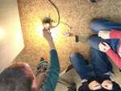
</a>

* Lehký úvod do elektroniky
  * Vysvětlení pojmu "napětí" <a href="https://www.youtube.com/watch?v=w82aSjLuD_8">pěkné video zde</a>
  * <a href="https://cs.wikipedia.org/wiki/Tesl%C5%AFv_transform%C3%A1tor">Teslův transformátor</a>
    * malinký transformátor z Aliexpresu
    * vytahování oblouku pomocí klíčů
    * přehrávání hudby pomocí jiskření
    * bezdrátové rozsvěcení úsporných žárovek, diod a tlumivek
* Elektrická stavebnice Boffin
  * Kdo neměl zájem o Teslův transformátor skládal projekty z Boffinu

## 18. hodina

* [scratch](https://scratch.mit.edu)
  * Seznámení s prostředím
  * V pravo nahoře je okno hry
  * Pod oknem hry jsou postavy/sprity
  * Na pravo od postav je úzká nudle s pozadími
  * Levá polovina souvisí s vybraným objektem (postava či pozadí) a umožňuje upravovat scénáře, kostýmy či zvuky (přepínáno pomocí "tabů" v levé horní části
  * Vyzkoušeli jsme si změnit pozadí, přidat několik postav, změnit jejich pozici, velikost i natočení a v neposlední řadě i upravovat kostýmy

## 19. hodina

* [scratch](https://scratch.mit.edu)
  * Opakování z minula
  * Úvod do zvuků
  * Vysvětlení pojmu "Události" a otestování prvního kódu (po kliknutí na mě přehraj zvuk do konce)

## 20. hodina

<a href="zacatecnici-2-04-scratch.jpg">
    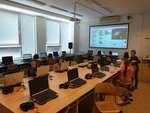
</a>

* [scratch](https://scratch.mit.edu)
  * Opakování a rozšíření naší hry "chytni kočku" [ukázka](https://scratch.mit.edu/projects/470669556) (naše verze ještě nezrychlovala, ale počítala již body)

## 21. hodina

* [scratch](https://scratch.mit.edu)
  * Přihlášení do Scratche, abychom mohli začít více-hodinový projekt "Chytání velikonočních vajíček"
  * Ukázali jsme si ovládání postavy pomocí události ``Po stisku klávesy [XXX]``, nevýhodou je, že se postavička posune, zastaví a pak začne utíkat jako divá. Proto jsme nahradili ovládání pomocí události tzv. ``polling``-em (tzn. periodickým dotazováním se na stav). Vytvořili jsme nekonečnou smyčku, ve které jsme se vždy zeptali pomocí ``když [je stisknuta klávesa "šipka doprava"]`` a ``když [je stisknuta klávesa "šipka doleva"]``, jestli hráč mačká požadované tlačítka a pokud ano, otočili jsme postavičku požadovaným směrem a posunuli ji o danou vzdálenost.

## 22. hodina

<a href="zacatecnici-2-06-scratch.jpg">
    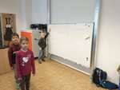
</a>

* [scratch](https://scratch.mit.edu)
  * Hrou u tabule jsme si zopakovali funkci pohybu pomocí událostí
  * Vytvořili jsme gravitaci a nechali padat objekty shora dolů

## 23. hodina

* [scratch](https://scratch.mit.edu)
  * Opakování gravitace (90° vpravo, 180° dolů, -90° vlevo a 0° nahoru)
  * Vysvětlení "klonování" objektů (vytvoříme jeden objekt, použijeme "klonuj sebe" a co se bude dít definujeme pomocí "když startuje můj klon"; pozor na nekonečné množství klonů, pokud něco vytvořím, musím to také odstranit pomocí "zruš tento klon"!)
  * Udělali jsme si jednoduchou mini-hru na chytání jablíček myší

## 24. hodina

* [scratch](https://scratch.mit.edu)
  * Opět práce na našem "velkém" projetku, k chodícímu panáčkovi jsme dodělali padající objekty. Příště ještě musíme vše doladit, vychytat chybičky a přidat počítání bodů

## 25. hodina

<a href="zacatecnici-2-09-scratch.jpg">
    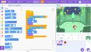
</a>

* [scratch](https://scratch.mit.edu)
  * Dokončení naší hry, jablíčka padají, panáček chodí a umí je sbírat
  * Kdo chtěl, mohl ještě hru vylepšovat - zvuky, pohyb panáčka, vynulování bodů, ...

## 26. hodina

* [scratch](https://scratch.mit.edu)
  * Kdo měl zájem hrál námi vyrobené hry a upravovat je (přidání cheatů, dalších zvuků, převleků...):
    * [https://scratch.mit.edu/projects/987087077](https://scratch.mit.edu/projects/987087077)
    * [https://scratch.mit.edu/projects/987088949](https://scratch.mit.edu/projects/987088949)
    * [https://scratch.mit.edu/projects/1003546041](https://scratch.mit.edu/projects/1003546041)
    * [https://scratch.mit.edu/projects/987093612](https://scratch.mit.edu/projects/987093612)
    * [https://scratch.mit.edu/projects/987091457](https://scratch.mit.edu/projects/987091457)
    * [https://scratch.mit.edu/projects/987091444](https://scratch.mit.edu/projects/987091444)
    * [https://scratch.mit.edu/projects/987092684](https://scratch.mit.edu/projects/987092684)
* [Šipkovaná](https://www.umimeinformatiku.cz/sipkovana)
  * Kdo se nechtěl věnovat Scratchi, řešil logické úlohy "šipkované"

## 27. hodina

* [Human Resource Machine](https://tomorrowcorporation.com/humanresourcemachine)
  * Malinko jiný styl programování, blíže k Assembleru
  * návod ([pdf](../assets/hrm.pdf), [odt](../assets/hrm.odt)); diagram procesoru ([pdf](../assets/processor.pdf), [odt

## 28. hodina

* [Human Resource Machine](https://tomorrowcorporation.com/humanresourcemachine)
  * Pokračovali jsme v zpracování vstupů a přidali jsme si podmíněný skok ``if zero``

## 29. hodina

<a href="zacatecnici-2-13-processor.jpg">
    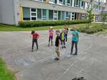
</a>

* Hra na processor
  * křídami jsme namalovali schéma jednoduchého 8bit processoru, každý dostal přidělený subsystém a hráli jsme si na to, co se stane po připojení napájení
  * materiály ([pdf](../assets/processor.pdf), [odt](../assets/processor.ods))
  * běh progamu řídí controller/dekodér. Po spuštění vynuluje PC a načte instrukci z adresy 0x00. Dekóduje ji, vykoná ji a zvýší PC o jedna (pokud instrukce nespecifikuje jinak, např. JMP)
  * vše probíhá do odpojení napájení, nebo do instrukce HLT

## 30. hodina

<a href="zacatecnici-2-14-pocitac2.jpg">
    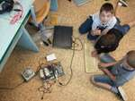
</a>
<a href="zacatecnici-2-14-pocitac.jpg">
    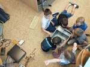
</a>

* Sestavování počítače
  * co je počítač, co je monitor, co jsou periferie?
  * co je uvnitř "krabice"?
    * procesor - počítá
    * operační paměť - zapamatuje si, co se nevejde do procesoru (ale jen do vypnutí proudu)
    * pevný disk - zapamatuje si věci na trvalo (ale trvá mu to dlouho)
    * grafická karta - zobrazí, co jí procesor řekne; dnes bývá početně výkonější, než sám procesor (přepočítává souřadnice, osvětlení, ...)
    * základní deska - propojuje vše dohromady, rozšiřuje porty pro připojení periferií
    * vypínače a diody - i bez nich to běží, když má člověk šroubovák (nebo cokoliv vodivého) a ví kam šáhnout

* * * * * * * * *

<a name="footnote1">1</a>: Dle psychologa [Jeana Piageta](https://cs.wikipedia.org/wiki/Jean\_Piaget)
nelze děti mladší 6-7 let učit systematické vědy, neboť se nacházejí
ve stádiu `názorového (prelogického) myšlení`, které ještě plně
nerespektuje logiku. Ukázka experimentu je ke shlédnutí například
[zde](https://www.youtube.com/watch?v=tQLpysTbFso) (doporučuji vyzkoušet),
výuka mateřského jazyku začíná také daleko dříve, než je děťátko schopné
jej pochopit a přirozeně se vytváří návyky a spoje, jež jednou vedou v
schopnost mluvit a myslet v daném jazyce. Bilingvální výchova pak vede
ke schopnosti mluvit a myslet ve více jazycích. Proto věřím, že správným
přístupem lze začít daleko dříve a sám využívám logické hry, roboty i
počítač ke hře a vlastně i výuce svých dětí takřka od narození.

